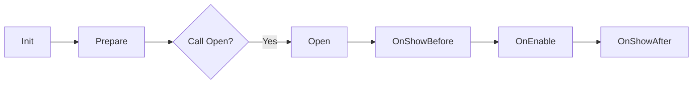
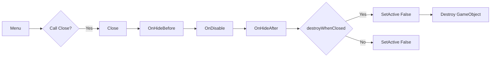

## MenuSystem

<details title="Table of Contents">
<summary>Table of Contents</summary>

- [A simple Menu Class workflow and features](#a-simple-menu-class-workflow-and-features)
</details>

Create a Enum for your menu names. For Example MenuName, Menus etc.
for [Usage examples][1]

[1]: ../Examples/MenuExample

```c#
public enum MenuName
{
    MyFirstMenu = 0,
    SecondMenu = 1,
}
```
Create menu and its arg class
```c#
using UKitchen.MenuSystem;

public class MyFirstMenu : Menu<MenuName, MyFirstMenuArgs, MyFirstMenu>
{
}

public class MyFirstMenuArgs : MenuArgs
{
}
```
```c#
using UKitchen.MenuSystem;

public class MySecondMenu : Menu<MenuName, MySecondMenurgs, MySecondMenu>
{
}

public class MySecondMenuArgs : MenuArgs
{
}
```
Create your ScriptableObjectInstaller class for your menu-prefabs and create its asset. MenuPrefabInstaller.asset add to SceneContext or CompositeScriptableObjectInstaller.
```c#
using System.Collections.Generic;
using MenuSystemSample;
using UKitchen.MenuSystem;
using UnityEngine;
using Zenject;

[CreateAssetMenu(fileName = "MenuPrefabInstaller", menuName = "Installers/MenuPrefabInstaller")]
public class MenuPrefabInstaller :  ScriptableObjectInstaller<MenuPrefabInstaller>
{
    public List<AbsMenu<MenuName>> menus;
    
    public override void InstallBindings()
    {
        menus.ForEach(s => 
        {
            switch(s.menuName)
            {
                case MenuName.MyFirstMenu:
                    Container.Bind<GameObject>().FromInstance(s.gameObject).WhenInjectedInto<MyFirstMenu.Factory>();
                    Container.BindFactory<Transform, IMenuArg, MyFirstMenu, MyFirstMenu.Factory>().FromFactory<MyFirstMenu.Factory>();     
                    break;
                case MenuName.SecondMenu:
                    Container.Bind<GameObject>().FromInstance(s.gameObject).WhenInjectedInto<MySecondMenu.Factory>();
                    Container.BindFactory<Transform, IMenuArg, MySecondMenu, MySecondMenu.Factory>().FromFactory<MySecondMenu.Factory>();     
                    break;
            }
        });
    }
}
```
Your menu factories now ready to injection.

Create your Menu Manager class. And add it to the scene. Add ZenjectBinding to the same object. BindType is "All Interfaces And Self".
```c#
using UKitchen.MenuSystem;
using Zenject;

public class GameMenuManager : AbsMenuManager<MenuName>
{
    [Inject] private MyFirstMenu.Factory _myFirstMenuFactory;
    [Inject] private MySecondMenu.Factory _mySecondMenuFactory;
    
    [Inject]
    public void Construct()
    {
        Init();
    }
    
    public override void Init()
    {
        base.Init();
        OpenMenu(MenuName.MyFirstMenu, new MyFirstMenuArgs{mode = MenuMode.Single});
    }
    
    public override void OpenMenu(MenuName menuName, IMenuArgs args)
    {
        if(!IsAlreadyOpen(menuName, args, true))
        {
            switch(menuName)
            {
                case MenuName.MyFirstMenu:
                    Open(_myFirstMenuFactory.Create(menuContainer, args), args);
                    break;
                case MenuName.SecondMenu:
                    Open(_mySecondMenuFactory.Create(popupContainer, args), args);
                    break;
            }
        }
    }
}
```
Menu control examples:
```c#
using UKitchen.MenuSystem;

public class MyFirstMenu : Menu<MenuName, MyFirstMenuArgs, MyFirstMenu>
{
    [Inject] private readonly GameMenuManager _menuManager;
    
    public void OnClick_OpenSecondMenuBtn()
    {
        _menuManager.OpenMenu(MenuName.SecondMenu, new MySecondMenuArgs{mode = MenuMode.Additive});
    }
    
    public void OnClick_CloseMenuBtn()
    {
        _menuManager.CloseMenu(menuName);
    }
}
```

#### A simple Menu Class workFlow and features

A menu opening workflow:


A menu closing workflow:

Simple Menu and often usage method examples:
```c#
public class SimpleMenu : Menu<MenuName, SimpleMenuArgs, SimpleMenu>
{
    protected override void OnShowBefore()
    {
        Debug.Log(Args.sampleItemCount);
        Debug.Log(Args.sampleItemleName);
    }

    protected override void OnShowAfter()
    {
    }

    protected override void OnHideBefore()
    {
    }

    protected override void OnHideAfter()
    {
    }
}

public class SimpleMenuArgs : MenuArgs
{
    public string sampleItemleName;
    public int sampleItemCount;
    
    public SimpleMenuArgs()
    {
        mode = MenuMode.Additive;
    }
}
```